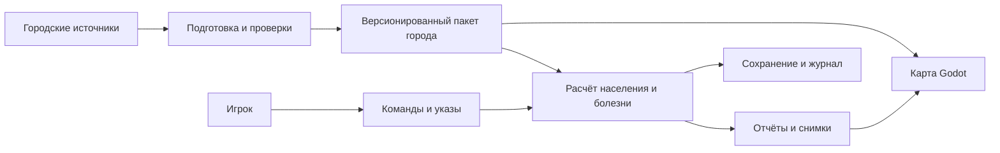

# Архитектура игры на Godot

Игра работает локально на устройстве. Godot отвечает за карту, интерфейс, ввод, звук и сохранение. Расчётный модуль получает городской пакет и команды игрока, продвигает игровое время и отдаёт снимки состояния. Подготовка геоданных выполняется отдельными инструментами разработчика и не требуется игроку.

Подтверждённая последовательность платформ — Mac и ПК, затем iOS. Под ПК предварительно понимается Windows; Linux и Android можно добавить позже. Зафиксирована версия Godot 4.7.2 stable (см. [decisions.md](decisions.md)); перечень архитектур фиксируется после пробных экспортов.

## Предлагаемый стек

| Часть | Предложение | Причина |
| --- | --- | --- |
| Игровой клиент | Godot 4, двухмерная карта, GDScript | Один проект интерфейса и мобильного ввода |
| Городское расчётное ядро | C++ через GDExtension, компактные массивы агентов | Индивидуальные состояния миллионов жителей без миллионов объектов Godot |
| Малый эталон модели | Простая реализация для тестовых сцен | Проверка математики и оптимизированного ядра |
| Подготовка геоданных | Python, инструменты обработки OSM и GIS | Вырезка, очистка, графы, статистика и сборка пакетов |
| Городские таблицы | Табличные промежуточные файлы, компактный бинарный пакет для игры | Простая обработка и ограниченное чтение на устройстве |
| Карта | Предварительно собранные геометрические участки и уровни подробности | Локальная загрузка только видимой геометрии |
| Настройки сценариев | JSON с версией схемы и проверкой значений | Изменение болезни и игрового баланса без изменения кода |

GDExtension позволяет Godot взаимодействовать с нативными библиотеками без пересборки самого движка. Это путь оптимизации, требующий сборок и проверки каждой платформы. Его наличие не гарантирует нужную скорость. [Официальная документация](https://docs.godotengine.org/en/stable/engine_details/engine_api/gdextension/what_is_gdextension.html).

Для двухмерной игры исходный кандидат — Compatibility; окончательный выбор делается по замерам на Mac и iPhone. Документация Godot относит этот renderer к вариантам для широкого диапазона устройств и 2D проектов. [Overview of renderers](https://docs.godotengine.org/en/stable/tutorials/rendering/renderers.html).

## Поток данных



## Предлагаемая структура каталогов

Ниже — целевая структура. Сейчас созданы `game/` (пустое приложение), `native/` (мост GDExtension с версией ядра), `tools/city_pipeline/` (сборка и проверка городского пакета), `data/manifests/` (реестр источников и конфигурация сборки) и тесты моста, паспорта и сборки; остальные каталоги появятся вместе с кодом.

```text
MP/
├── README.md
├── docs/
│   ├── vision.md
│   ├── data.md
│   ├── model.md
│   ├── architecture.md
│   ├── roadmap.md
│   └── decisions.md
├── game/
│   ├── project.godot
│   ├── scenes/               # карта, меню, HUD, панели
│   ├── scripts/
│   │   ├── app/              # сессия, время, сохранения
│   │   ├── map/              # участки, слои, камера, выбор
│   │   ├── ui/               # карточки, графики, ввод
│   │   └── sim_bridge/       # команды и снимки ядра
│   ├── sim/                  # малый эталон и адаптеры модели
│   │   ├── core/             # часы, RNG, события, таблицы
│   │   ├── population/       # профили и индивидуальные состояния
│   │   ├── mobility/         # расписания, потоки, маршруты
│   │   ├── contacts/         # места и контактные группы
│   │   ├── disease/          # риск и развитие состояния
│   │   ├── healthcare/       # очереди, выявление, госпитализация
│   │   ├── policies/         # маски, удалённая работа, кордоны
│   │   ├── observation/      # информация игрока и истинные метрики
│   │   └── opponents/        # простые автоматические стороны
│   ├── scenarios/            # игровые правила и параметры
│   └── assets/               # графика, звук, шрифты
├── tools/
│   └── city_pipeline/        # получение, нормализация, сборка
├── data/
│   ├── manifests/            # источники, версии, лицензии
│   ├── raw/                  # исходники вне обычной истории Git
│   ├── processed/            # промежуточные данные
│   └── packages/             # готовые городские пакеты
├── native/                   # основное расчётное ядро C++
│   ├── src/                  # population, mobility, contacts, disease и другие модули
│   ├── include/              # интерфейс ядра
│   └── godot_bridge/         # GDExtension и сборки платформ
├── tests/
│   ├── model/                # инварианты и вероятностные проверки
│   ├── scenarios/            # малые города и сквозные сценарии
│   └── integration/          # мост Godot и экспорт
└── benchmarks/               # скорость, память, масштаб
```

## Границы модулей

Ядро не обращается к камере, сценам и элементам интерфейса. Здания, жители и контактные группы — данные, а не отдельные Godot Nodes. В сценах находятся только отображаемые участки и выбранные объекты. Число жителей не определяет число узлов сцены.

Минимальный интерфейс ядра: загрузить пакет и сценарий, применить команду, продвинуть время, получить снимок, сохранить и восстановить состояние. Команды содержат ID, игровое время и параметры. Ядро проверяет бюджет, область и допустимость действия.

Начальный контракт подготовки данных описан в [формате паспорта версии 1](city-package.md). Проверка паспорта работает в Python; чтение пакета ядром и конкретные бинарные форматы будут добавлены отдельно.

Одна расчётная задача владеет изменяемым состоянием. Интерфейс получает неизменяемые снимки и отправляет команды через очередь. Работа с деревом сцены остаётся на основном потоке. Сначала допускается один вычислительный поток; параллелизм добавляется после проверки порядка и профилирования.

C++ ядро предлагается сразу для городского масштаба; GDScript используется для интерфейса и организации сессии. Модель на малых сценах проверяется простой эталонной реализацией. Нативная библиотека и мост должны собираться на Mac, выбранной платформе ПК и iOS уже в раннем техническом прототипе.

## Карта улиц и зданий

Godot не получает полноценную карту автоматически из файла OSM. Нужен отдельный сборщик: он вырезает регион, преобразует координаты в локальную плоскость, создаёт линии улиц, контуры зданий, подписи, индексы выбора и несколько уровней подробности.

Предлагается локальный формат участков с простыми бинарными таблицами и заранее подготовленными мешами для геометрии. Подписи и медицинские объекты лежат в отдельных слоях. Кеш имеет ограничение памяти. Выбор объекта по координатам возвращает стабильный ID, связанный с расчётной таблицей.

На общем виде показываются зоны, транспорт и крупные очаги; на близком — улицы, здания и выбранные траектории. Видимые люди рисуются простыми точками по их ID и положению на общей траектории. Для множества точек проверяется пакетная отрисовка по пространственным участкам. На общем виде показываются тепловые карты и потоки. Отдельный Node или Sprite для каждого жителя не создаётся.

Кандидат для пакетной отрисовки — MultiMesh с отдельными наборами по участкам карты: видимость отдельных экземпляров внутри одного MultiMesh не отсекается автоматически. Это требует проверки на выбранной версии Godot и устройстве. [Optimization using MultiMeshes](https://docs.godotengine.org/en/stable/tutorials/performance/using_multimesh.html).

Приближение меняет геометрию и подписи, а не точность эпидемии. Базовый город рассчитывается даже когда геометрический участок выгружен. Недоступные онлайн сервисы не останавливают уже скачанный сценарий.

## Память индивидуальных жителей

Основные атрибуты хранятся отдельными массивами: ID зданий и семей — целые числа, группы возраста и профилей — компактные коды. Общие расписания, маршруты и таблицы коэффициентов разделяются множеством жителей. Строки, словари и объекты на каждого человека не используются в массовой части ядра.

Пример для проектирования, не оценка населения Москвы: при 20 миллионах агентов и 64 байтах профиля вместе с текущим состоянием только эти массивы потребуют около 1,28 ГБ в десятичных единицах. При 32 байтах — около 640 МБ. Граф, индексы контактов, очереди событий, карта, временные буферы и журнал увеличивают расход. Поэтому размер записи измеряется до добавления всех механик. Десять атрибутов не означают десять полей типа double.

События движения, симптомов и посещений хранятся компактно; способ очереди выбирается по замеру. На каждом графическом кадре ядро не обновляет всех жителей. Положение видимой точки можно интерполировать между событиями маршрута. Контакты считаются по фактическим местам и группам, без сравнения каждой пары населения.

## Производительность и мобильная версия

Ранний замер должен включать весь регион: число жителей, зон, активных контактных групп, поездок, медицинских очередей, объём карты, память и время одного игрового дня. Самый тяжёлый режим — не только первый случай, но и широкая вспышка с миллионами активных состояний и несколькими кордонами.

Возможные меры: компактные массивы атрибутов, общие таблицы профилей, кеш маршрутов, события вместо ежесекундного обхода всех людей, группировка одинаковых вычислений и ограниченная передача данных в Godot. Это сохраняет индивидуальные ID и состояния. Сравнение всех людей со всеми имеет квадратичную сложность и не используется.

Предварительные цели на согласованном устройстве: 60 кадров/с на компьютере и 30 на телефоне во время обычного просмотра карты; игровые сутки за 5–15 секунд на компьютере в ускорении. Это инженерные цели, не результаты замеров. Лимиты памяти, загрузки и скорость iOS задаются после выбора тестового iPhone.

Приостановка приложения сохраняет состояние; возврат продолжает с той же минуты. По умолчанию болезнь не развивается скрыто по реальному времени, пока приложение закрыто. Настройки графики могут менять отображение, но не смысл модели.

Экспорт iOS требует macOS и Xcode. Пробную сборку на физическом iPhone нужно сделать до завершения игрового интерфейса, особенно если будет нативная библиотека. [Godot Exporting for iOS](https://docs.godotengine.org/en/stable/tutorials/export/exporting_for_ios.html).

## Сохранение и воспроизводимость

Сохранение содержит версии ядра и схемы, ID и хеш городского пакета, сценарий, игровое время, профили и состояния всех жителей, состояния болезни, поездки, очереди, меры, ресурсные показатели, наблюдения, будущие события, историю отслеживаемых людей и состояние RNG.

Seed достаточен для начала повторного прогона, но не заменяет состояние генератора в середине партии. Запись ведётся атомарно с предыдущей резервной копией. Несовместимая версия данных обнаруживается до загрузки; пользователь получает понятное сообщение.

Для повторов сохраняются исходный сценарий и журнал команд. Совпадение результатов между Mac, Windows и iOS проверяется отдельно; одинаковый seed сам по себе не гарантирует одинаковую арифметику всех сборок.
